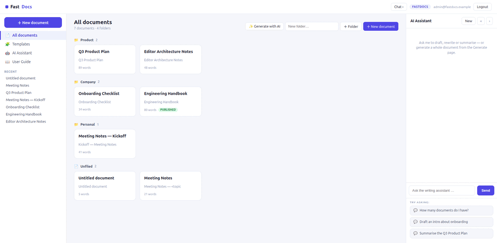
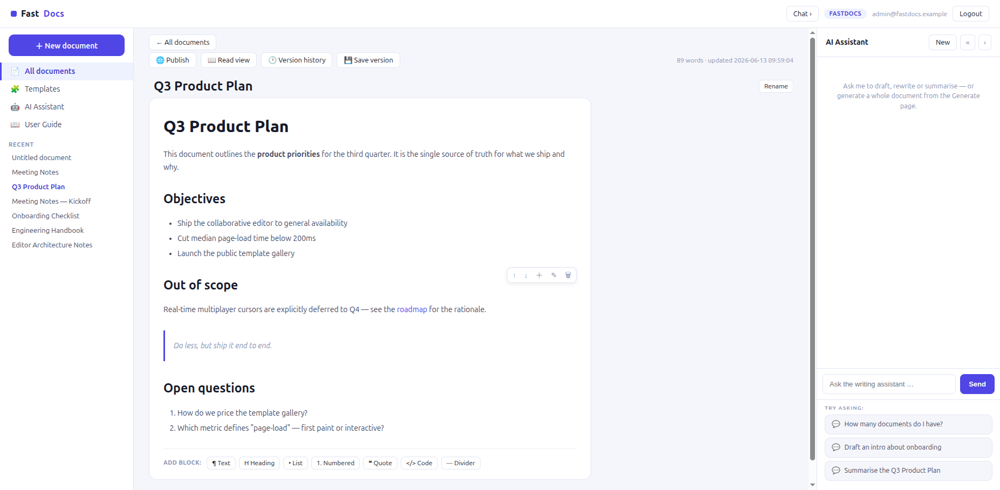

# FastDocs



A server-rendered, **HTMX-driven document editor** built with
[FastHTML](https://fastht.ml) — a compact port of the core of
[Frappe Writer](https://github.com/frappe/writer) (Vue 3 + TipTap upstream →
server-rendered Python + SQLite here). **No JavaScript framework.**

Part of the [FastHTML OSS migrations](https://github.com/predictivelabsai/fasthtml-oss-migrations)
suite — a 3-pane layout, deterministic synthetic data, a multi-provider AI
assistant, and native + Docker deploy, shared across a family of Frappe ports.



## What it does

- **Block editor** — a document is an ordered list of typed blocks (headings,
  paragraphs, bulleted / numbered lists, quotes, code, dividers). Move, add,
  edit and delete blocks; each block is **Markdown**. All edits are HTMX
  fragment swaps — no full-page reloads, no client framework.
- **Folders & library** — documents grouped by folder on the home page.
- **Templates** — start a new document from a reusable structure (Meeting Notes,
  Project Brief, Blog Post).
- **Version history** — snapshot a document and restore any earlier snapshot
  (a restore auto-snapshots the current state first, so it's reversible).
- **Public share links** — publish a document to a read-only `/p/<token>` URL
  that needs no login; unpublish to revoke.
- **AI assistant** — a right-rail chat that drafts, rewrites and summarises,
  grounded in your workspace, plus **Generate with AI** to write a whole
  document from a prompt. Multi-provider and key-optional (slash-commands work
  with no key).

## Run it

```bash
python -m venv .venv && . .venv/bin/activate
pip install -r requirements.txt
python seed.py            # build the synthetic SQLite DB
python web_app.py         # http://localhost:5016
```

Login with `admin@fastdocs.example` / `FastDocs2026$` (override in `.env`; copy
`.env.sample`). To enable AI generation + chat, set `MODEL_PROVIDER` and the
matching API key.

### Docker

```bash
docker compose up --build    # seeds on first boot, DB on a named volume
```

## Architecture

Identical to its sibling apps:

- **`db.py`** — SQLite data layer (`connect()` with `busy_timeout`, `cursor()`,
  `rows/one/scalar`, a `SCHEMA` + idempotent `init_schema()`), the block / doc /
  template / version / publish write helpers.
- **`seed.py`** — deterministic, PII-free synthetic workspace.
- **`web_app.py`** — `fast_app`, session-cookie login, `@rt` routes, `_ensure_db()`.
- **`web/layout.py`** — the 3-pane shell (top bar · left nav · center · AI rail),
  design tokens, and the one block of vanilla JS that drives the SSE chat.
- **`web/views.py`** — block rendering + the `doc_main(id)` / `doc_detail(id)`
  HTMX fragment-swap editor, templates, versions, read & public article views.
- **`web/ai.py`** — multi-provider streaming, `handle_command()` slash-commands,
  a `snapshot()` that grounds chat in live document content, and `generate_doc()`.

Ports are contiguous across the suite; FastDocs runs on **5016**.

## Scope

A demonstrator models one coherent vertical, not the full upstream sprawl.
FastDocs ports the document-editing core of Frappe Writer; **real-time
collaborative editing (Yjs / OT) is deliberately out of scope** (single-user by
design). See [docs/ROADMAP.md](docs/ROADMAP.md) for the gap vs upstream and
[SKILLS.md](SKILLS.md) for the capability reference.

MIT licensed. Synthetic data only — no PII.
