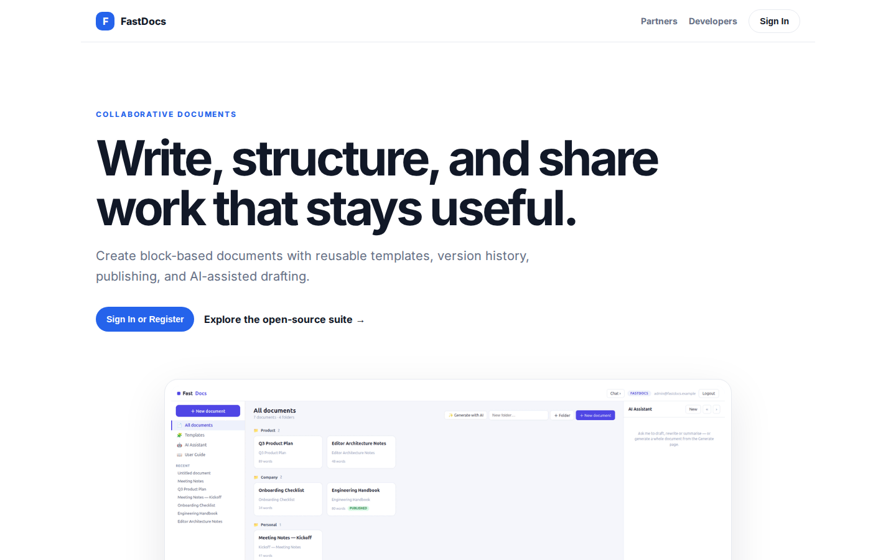
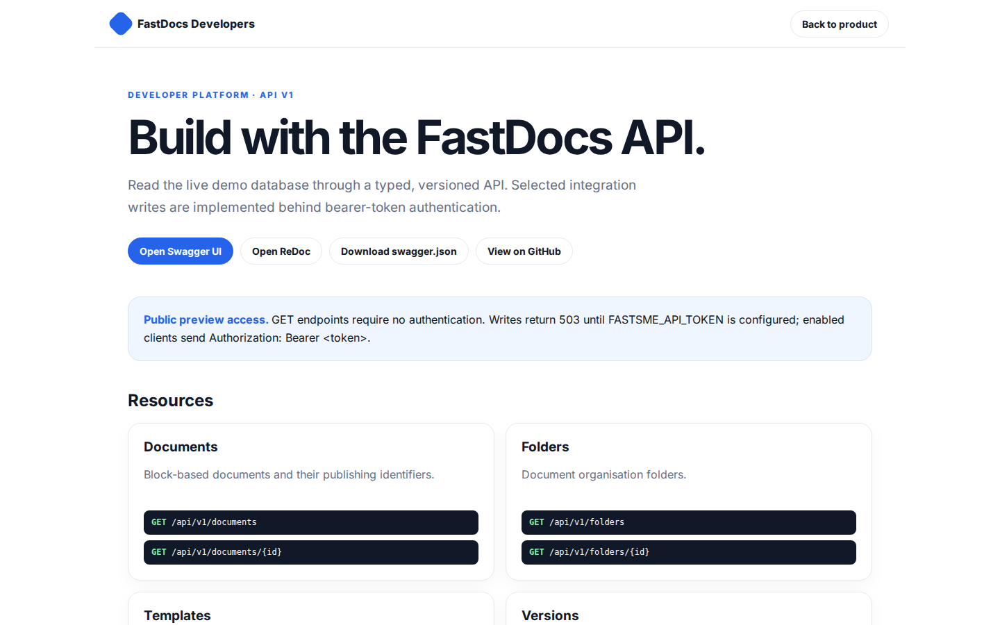

# FastDocs Platform Guide

**Published:** 2026-08-19
**Platform:** [https://docs.fastsme.com](https://docs.fastsme.com)
**Source:** [github.com/predictivelabsai/FastDocs](https://github.com/predictivelabsai/FastDocs)

## Platform overview

A server-rendered, **HTMX-driven document editor** built with — a compact port of the core of (Vue 3 + TipTap upstream → server-rendered Python + SQLite here). **No JavaScript framework.**

This visual guide was reviewed against the live product using Playwright. Screens and available navigation can vary by account, role, and deployment configuration.

## 1. Write, structure, and share work that stays useful.

COLLABORATIVE DOCUMENTS Write, structure, and share work that stays useful. Create block-based documents with reusable templates, version history, publishing, and AI-assisted drafting. Sign In or Register Explore the open-source suite → Product tour · see the

Screen reviewed at: [https://docs.fastsme.com/](https://docs.fastsme.com/)

## 2. Build with the FastDocs API.

FastDocs Developers Back to product DEVELOPER PLATFORM · API V1 Build with the FastDocs API. Read the live demo database through a typed, versioned API. Selected integration writes are implemented behind bearer-token authentication. Open Swagger UI Open ReDoc

Screen reviewed at: [https://docs.fastsme.com/developers](https://docs.fastsme.com/developers)

## 3. Sign in

Sign in with Google Sign in to continue to fastsme.com Email or phone Forgot email? Next Create account Afrikaans azərbaycan bosanski català Čeština Cymraeg Dansk Deutsch eesti English (United Kingdom) English (United States) Español (España) Español (Latinoam

Screen reviewed at: [https://accounts.google.com/v3/signin/identifier?opparams=%253F&dsh=S-1356954309%3A1787122686146270&access_type=online&client_id=887059023987-2a7spj1m82eivobdbt1itb3cqca6tpt1.apps.googleusercontent.com&o2v=2&prompt=select_account&redirect_uri=https%3A%2F%2Fdocs.fastsme.com%2Fauth%2Fgoogle%2Fcallback&response_type=code&scope=openid+email+profile&service=lso&state=1-pta_gMgv0LmJWiJVe1uJgMy-0tYWbueJDN5lsfn0E&flowName=GeneralOAuthLite&continue=https%3A%2F%2Faccounts.google.com%2Fsignin%2Foauth%2Flegacy%2Fconsent%3Fauthuser%3Dunknown%26part%3DAJi8hAO6dXL1I7ZDUQY5fRSY_3eRJZdLXoblJKHYFz7acHkQm12LBlZ37d7SAjVscmhQERI-K7K_4WFKVugyAuYTUte0mAIKWF1l4VKd6W5xWodPMoUrz8gSpIZB81wbKEtfcE2_7bD9ipTX-1_2qhaJrlcKvBi9pXyBohA5c25DJYNmi2g4PEeOXr8u0zfV6X2mzZpx_hUQYWrHuAj44TPOk__WgjDW8WVxCvOMf7L17EmfB5pJUNR0VBykwfcAYRF-QcOhaimRXvnAY1HsvPpaAQqp_2TSsVN1Bp6jrHvrffsnd4IcTIvx37-P0qAdUjOA5vCRWc_IiJ9PbMl-w_PULbkhLZl74yhpFxMPF4TbPXxN3hFrQ6hSwsOf7JfOvqiFj9r5FK5FedDQIvZ5iHKtMrDatcazHVLH7CaZxmfAZFp9yL8yDz2_8e-Ro4nR0sSTeSqSFwcqawUwj7sCBMxbo4hvKQTtRA%26flowName%3DGeneralOAuthFlow%26as%3DS-1356954309%253A1787122686146270%26client_id%3D887059023987-2a7spj1m82eivobdbt1itb3cqca6tpt1.apps.googleusercontent.com%23&app_domain=https%3A%2F%2Fdocs.fastsme.com&rart=ANgoxcdfcIlqkIJjQdbzw8wgVLmgaEF4P8PUvE-lxDZircVe739CnBKWV3cNnx3eh88oTA3jg1TZrpw-PkKYIvu7EsGt_Pv5ULZZ-iW4j-8FjAdy0__5ZaE](https://accounts.google.com/v3/signin/identifier?opparams=%253F&dsh=S-1356954309%3A1787122686146270&access_type=online&client_id=887059023987-2a7spj1m82eivobdbt1itb3cqca6tpt1.apps.googleusercontent.com&o2v=2&prompt=select_account&redirect_uri=https%3A%2F%2Fdocs.fastsme.com%2Fauth%2Fgoogle%2Fcallback&response_type=code&scope=openid+email+profile&service=lso&state=1-pta_gMgv0LmJWiJVe1uJgMy-0tYWbueJDN5lsfn0E&flowName=GeneralOAuthLite&continue=https%3A%2F%2Faccounts.google.com%2Fsignin%2Foauth%2Flegacy%2Fconsent%3Fauthuser%3Dunknown%26part%3DAJi8hAO6dXL1I7ZDUQY5fRSY_3eRJZdLXoblJKHYFz7acHkQm12LBlZ37d7SAjVscmhQERI-K7K_4WFKVugyAuYTUte0mAIKWF1l4VKd6W5xWodPMoUrz8gSpIZB81wbKEtfcE2_7bD9ipTX-1_2qhaJrlcKvBi9pXyBohA5c25DJYNmi2g4PEeOXr8u0zfV6X2mzZpx_hUQYWrHuAj44TPOk__WgjDW8WVxCvOMf7L17EmfB5pJUNR0VBykwfcAYRF-QcOhaimRXvnAY1HsvPpaAQqp_2TSsVN1Bp6jrHvrffsnd4IcTIvx37-P0qAdUjOA5vCRWc_IiJ9PbMl-w_PULbkhLZl74yhpFxMPF4TbPXxN3hFrQ6hSwsOf7JfOvqiFj9r5FK5FedDQIvZ5iHKtMrDatcazHVLH7CaZxmfAZFp9yL8yDz2_8e-Ro4nR0sSTeSqSFwcqawUwj7sCBMxbo4hvKQTtRA%26flowName%3DGeneralOAuthFlow%26as%3DS-1356954309%253A1787122686146270%26client_id%3D887059023987-2a7spj1m82eivobdbt1itb3cqca6tpt1.apps.googleusercontent.com%23&app_domain=https%3A%2F%2Fdocs.fastsme.com&rart=ANgoxcdfcIlqkIJjQdbzw8wgVLmgaEF4P8PUvE-lxDZircVe739CnBKWV3cNnx3eh88oTA3jg1TZrpw-PkKYIvu7EsGt_Pv5ULZZ-iW4j-8FjAdy0__5ZaE)

## Getting started

Visit [https://docs.fastsme.com](https://docs.fastsme.com) to explore FastDocs. For source code and deployment details, use the GitHub link above.
